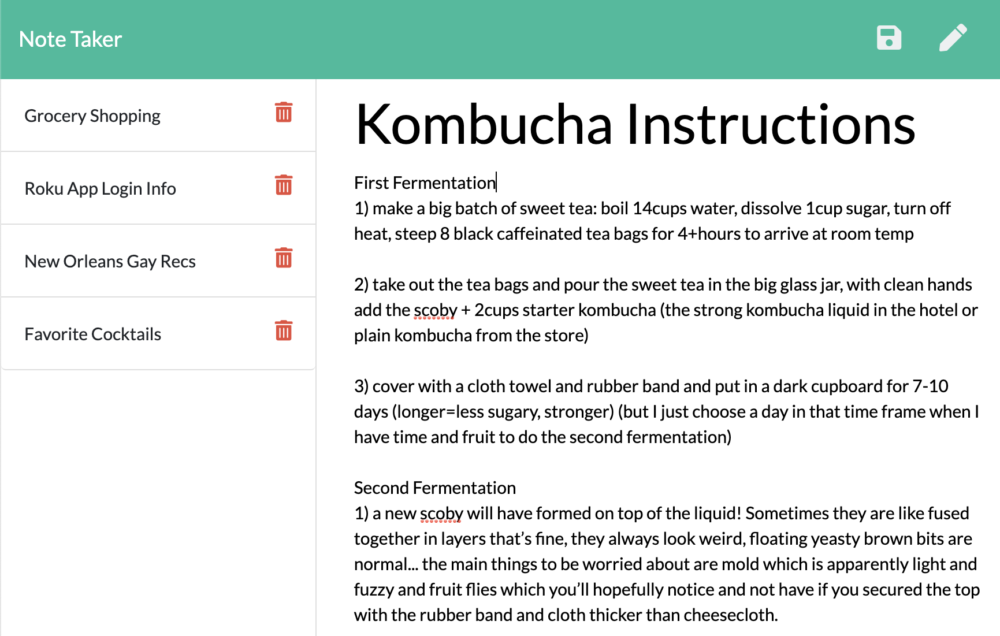

# Note Taker
An application created from an existing frontend that uses an Express.js backend to write, save, and delete notes

## Table of Contents
- [Installation Steps](#installation)
- [Deployed Application](#deployed-application)
- [Screenshots](#screenshots)
- [Licenses](#licenses)

---
## Installation 
Node.js and npm must be installed, as well as the Express framework and the Uniqid package.

## Deployed  Application
[View the Deployed Application on Heroku](https://dandandanoneil-note-taker.herokuapp.com/)

## Screenshots
Landing Page:

Notes Page:

## Licenses
### GNU GPL vs License

Copyright 2020 Dan O'Neil (dandandanoneil)

This program is free software: you can redistribute it and/or modify it under the terms of the GNU General Public License as published by the Free Software Foundation, either version 3 of the License, or (at your option) any later version.

This program is distributed in the hope that it will be useful, but WITHOUT ANY WARRANTY; without even the implied warranty of MERCHANTABILITY or FITNESS FOR A PARTICULAR PURPOSE.  See the GNU General Public License for more details.

Read more at <https://www.gnu.org/licenses/>.

---
Generated using [README Generator](https://github.com/dandandanoneil/readme-generator)
